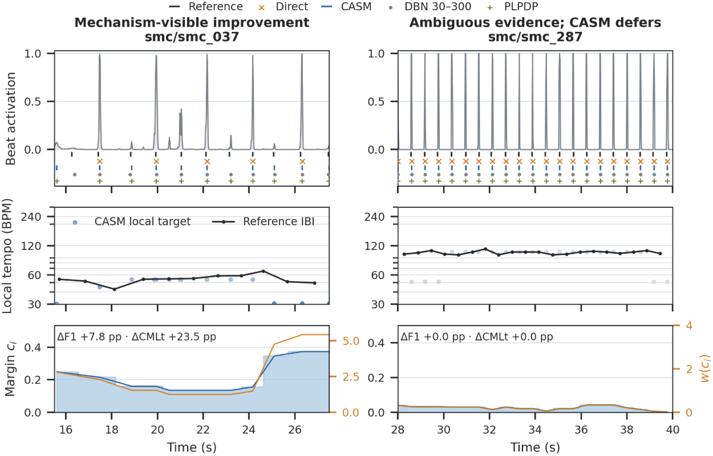
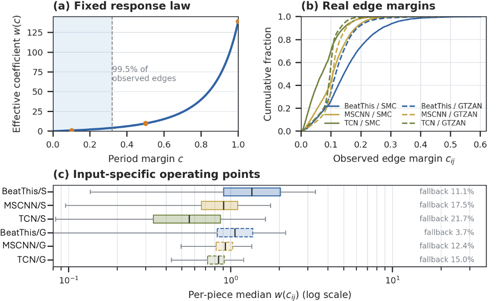

# CASM v3：Introduction、Related Work 与 Methodology 中文译稿

本文档对应 `casm_v3.tex` 中重新撰写的 Introduction、Related Work 和 Methodology。图片按论文中的出现顺序嵌入：`p0.jpg` 用于引言中的真实案例预览，`p1.jpg` 用于方法章节中解释输入条件化的约束强度。

## 1. 引言（Introduction）

节拍跟踪器的最后一个解码环节，看似简单，实际上会显著影响最终结果。神经网络可能在真正的节拍位置给出很高的逐帧概率，但输出中仍会出现重复节拍、漏拍、节拍层级切换，或与节拍网格不一致的重拍。事件级 F-measure 关注局部位置是否准确，而连续性指标还要求系统在一段时间内保持同一种节拍层级解释。因此，解码器面临一个实际矛盾：约束太弱，虽然尊重神经网络，却可能得到不稳定的节拍时钟；约束太强，则可能覆盖原本正确但具有表现性或不常见的节奏证据。

动态贝叶斯网络（DBN）通过寻找一条最能解释所有帧的“速度—相位—拍号”状态路径来处理这个问题。通俗地说，输入音乐会在一张预先设定好的时刻表中选择路线：BPM 范围、允许的拍号以及改变速度的代价，都在看到当前曲目之前就已经固定。DBN 推断出的状态路径当然会随输入改变，但当 activation 同时支持可信的半速或倍速解释时，它的转移规律并不会因此自动变软。CASM 采用互补的视角：它只考虑 activation 支持的峰值，直接评价两个候选峰之间完整的时间间隔，并让局部 activation 决定“节拍规律性”应该占多大权重。因此，两者真正的区别并不是简单的“自适应推断”与“非自适应推断”，而是 **固定的 DBN 转移规律** 与 **由输入决定强弱的分段惩罚**。这个区别在困难音乐上尤为重要：针对某个语料库重新调节 DBN 虽然可能有效，却会削弱“开箱即用迁移”的说服力。另一方面，不使用后处理的跟踪器虽然可以避开部分 DBN 错误，但最简单的峰值选择又可能牺牲序列连续性。

PLPDP 是本研究最直接的起点。它证明了后处理器可以不再依赖单一的全局速度偏好，而是从主导局部脉冲（predominant local pulse，PLP）中取得局部节拍间隔与置信度。我们保留它最核心的思想——**时间先验应该听取当前 activation 的意见**——并进一步处理一个尚未解决的风险：最强的局部周期可能只比另一个竞争节拍层级略强一点。CASM 因此计算“最佳周期与次佳周期之间的 margin”。如果最佳周期明显胜出，就产生窄而强的时长偏好；如果 margin 很小，就同时减弱并放宽这个偏好，让神经网络峰值本身来决定输出。

下图预览了这两种行为。左侧中，Direct 主要只保留了每两个强峰中的一个；CASM 利用有充分支持的局部周期，从已经存在但较弱的 activation 极大值中补回中间节拍，从而修复连续性，而不是把节拍移动到 activation 不支持的位置。右侧中，互为倍频关系的周期假设发生竞争，因此 CASM 主动压低结构约束，并保持与 Direct 完全相同的路径。这里没有触发 count-ratio safeguard；真正发生变化的是分段评分本身。

**图注翻译。** CASM 在真实 Beat This / SMC OOF activation 上的示例行为。左：得到支持的局部周期帮助系统找回较弱但确实由 activation 支持的节拍。右：较小的周期 margin 会减弱时长项，因此 CASM 退让给 Direct。Reference IBI 只用于帮助读图，CASM 从未使用它。曲目和窗口是在实验后为了展示机制而选取，不能用于估计平均性能。

本文的三项贡献如下。

1. 在 PLPDP 的基础上，我们把节拍解码写成稀疏的 semi-Markov 路径；每个分段的目标时长、约束强度和容忍宽度，都由两个端点的局部周期证据及其歧义共同决定。
2. 我们加入节拍数量与重拍一致性两道 safeguard，得到一个确定性的 plug-in；它不需要重新训练上游网络，也不需要逐曲设置 BPM 或拍号。
3. 我们在三种 activation backbone 上研究同一个冻结 operating point，并分析解码器 calibration 数据的规模与组成如何影响迁移。

## 2. 相关工作（Related Work）

### 2.1 结构化后处理

动态规划很早就被用于平衡起音证据与节拍间隔规律性。贝叶斯节拍位置模型使用主导节拍间隔；随后，学习式 CRF 又从节拍扩展到重拍、长距离段落一致性以及特定音乐类型中的微时值。另一条路线使用共振梳状滤波器先估计主导周期，再对齐事件；DBN 则枚举“速度—相位—拍号”状态，并解码最可能的轨迹。这些方法的状态表达与优化方式不同，但共享一个重要原则：有噪声的逐帧证据应该作为一个序列来解释，而不能只对每一帧独立做阈值判断。

### 2.2 从 PLPDP 到歧义感知的局部约束

PLPDP 是 CASM 的直接方法学前身。它的核心诊断是：固定的全局速度惩罚——包括常见 HMM 跟踪器中依靠经验设定的转移规律——对于表现性速度变化可能过于僵硬。PLPDP 从 PLP 中提取随时间变化的节拍间隔和置信度曲线，再用这两个局部量替换稠密逐帧动态规划中的全局目标与全局权重。后续工作把 PLPDP 扩展到实时场景，而 dPLP 则使局部脉冲估计变得可微。

CASM 是对这条研究路线的继续推进，而不是把 PLPDP 只当作一个无关的 baseline。PLPDP 问的是：“当前的局部脉冲是什么？它的 PLP 峰有多强？”CASM 进一步追问：“这个脉冲相对于下一个合理解释，到底赢得有多明显？”具体来说，CASM 在每个保留下来的 activation 极大值周围计算最佳周期与次佳周期的 margin，再合并一条边两端的上下文，用结果同时改变完整“事件到事件”时长代价的强度和容忍宽度。CASM 的路径是稀疏的，并始终锚定在真实观测到的极大值上；PLPDP 则可以在每个时间帧上进行评价。这个扩展专门面向半速/倍速竞争：当没有任何一个周期明显胜出时，解码器就不应该自信地强制采用其中任何一个。

Reliability-informed beat tracking 更早提出了一个更一般的原则：时间结构约束的力度应随证据质量改变。CASM 的 margin 是局部、确定性的周期分离分数，而不是对整首曲目准确率的预测。CASM 也不同于已有的因果一维 semi-Markov 状态空间模型：后者维护逐帧后验，并在线调整 jump-back distribution；CASM 则在候选事件之间进行离线的最大分数路径搜索。它也不是 semi-CRF，因为它的 potential 是人工定义的、未归一化的，并且不通过学习得到。

### 2.3 Plug-in 解码之外的方案

粒子滤波器可以在线维护多个速度假设，BeatNet/BeatNet+ 又把这一路线扩展到实时的联合节奏分析。另一类工作使用用户标注来适配跟踪器。更近期的方法则取消或重新设计后处理：masked diffusion 通过反复细化来学习连贯序列，BeatFCOS 把节拍间隔当作对象并使用 Soft-NMS，还有工作直接重新定义预测目标。这些路线要么改变预测器本身，要么引入额外监督。CASM 关注的是另一种常见部署场景：我们只有一个已经冻结的跟踪器，以及它输出的 activation。

## 3. 方法（Methodology）

### 3.1 方法概览及其与 PLPDP 的继承关系

设冻结的上游跟踪器以帧率 \(F\) 输出 beat logit \(z_t^{\mathrm b}\) 与 downbeat logit \(z_t^{\mathrm d}\)。与 PLPDP 一样，CASM 从当前 beat activation 中推导局部周期以及对该周期的支持程度。CASM 在此基础上作出两项改变。第一，它不在所有帧上解码，而只在稀疏的 activation 极大值集合上解码。第二，它所用的支持度不是单个周期峰的绝对高度，而是最佳周期与竞争周期之间的分离程度；这个量同时控制所选周期应当被执行得多强、允许偏离得多宽。全局参数只定义一条冻结的“证据到约束”响应规律；每一条候选分段在这条规律上的实际 operating point，则由当前输入决定。

### 3.2 候选事件分段

令

\[
a_t=\operatorname{sigmoid}(z_t^{\mathrm b}),
\]

并把高于阈值 \(\theta_{\mathrm c}\) 的局部极大值保留为候选集合
\(\mathcal C=\{t_1,\ldots,t_N\}\)。边 \((i,j)\) 表示从候选 \(i\) 到候选 \(j\) 的完整经过时间
\(\Delta_{ij}=(t_j-t_i)/F\)，只允许落在 30--300 BPM 对应的范围内。若 \(e_i\) 是经过裁剪的 activation 证据，CASM 选择使下式最大的路径 \(\pi=(i_1,\ldots,i_K)\)：

\[
\mathcal S(\pi)=\sum_{k=1}^{K}e_{i_k}
-\sum_{k=2}^{K}D_{i_{k-1},i_k}.
\]

第一项奖励像节拍的候选峰，第二项惩罚不合理的相邻节拍时长。CASM 被称为 semi-Markov，准确含义就在这里：一次转移直接跨过一个长度可变的“候选到候选”分段，并对整个分段的时长只评分一次。它不是生成式 hidden semi-Markov model，这些分段 potential 也不是通过训练学到的。

### 3.3 局部周期与歧义

在每个候选点 \(i\) 周围的局部窗口 \(\mathcal W_i\) 中，CASM 用归一化自相关给所有允许的整数 lag \(\ell\) 打分：

\[
q_i(\ell)=
\frac{\left\langle a_u a_{u-\ell}\right\rangle_{u\in\mathcal W_i}}
{\sqrt{\left\langle a_u^2\right\rangle_{u\in\mathcal W_i}
       \left\langle a_{u-\ell}^2\right\rangle_{u\in\mathcal W_i}
       +\epsilon_q}}
\left(\frac{\ell_{\min}}{\ell}\right)^{\beta}.
\]

信号范围外使用零填充，最后一项是很轻的快速速度偏好。得分最高的 lag 为
\(\ell_i^\star=\arg\max_\ell q_i(\ell)\)，对应的局部周期为
\(\tau_i=\ell_i^\star/F\)。随后，CASM 把这个最佳 lag 与其 \(\pm2\) 帧邻域之外的最佳竞争 lag 比较：

\[
c_i=\operatorname{clip}_{[0,1]}\!\left(
\frac{q_i(\ell_i^\star)-
\max_{\ell:\,|\ell-\ell_i^\star|>2}q_i(\ell)}
{|q_i(\ell_i^\star)|+\epsilon_c}\right).
\]

这里的 \(c_i\) 是“周期分离 margin”，不是经过概率校准的正确率。数值大，表示一个局部周期明显胜出；数值小，表示邻近周期或半速/倍速解释仍然具有竞争力。\(\tau_i\) 和 \(c_i\) 都会在连续五个候选点上做中值滤波，以减少抖动。

### 3.4 歧义条件化的分段代价

对于边 \((i,j)\)，CASM 用几何平均对两个端点的上下文做对称合并：

\[
\bar\tau_{ij}=\sqrt{\tau_i\tau_j},
\qquad
c_{ij}=\sqrt{c_i c_j}.
\]

然后定义

\[
\begin{aligned}
\sigma(c)&=\sigma_0+(1-c)\sigma_{\mathrm u}, \\
w(c)&=\frac{\lambda c}{2\sigma(c)^2}, \\
D_{ij}&=w(c_{ij})
\left[\log\!\left(\frac{\Delta_{ij}}{\bar\tau_{ij}}\right)\right]^2.
\end{aligned}
\]

对数比值使“偏快相同比例”和“偏慢相同比例”受到对称处理。更关键的是，margin 在这里同时发挥两次作用：当 \(c\) 较高时，\(\sigma(c)\) 变窄且 \(w(c)\) 增大；当 \(c\) 较低时，可容忍的偏差范围变宽，同时惩罚权重减小。因此，当局部脉冲很清楚时，CASM 能够选择较弱但符合节奏规律的候选峰；当周期证据含糊时，它又不会把可疑的节拍网格强加给输出。

下图把上述公式与真实解码行为连接起来。panel (a) 是由全局参数固定的唯一响应规律；panel (b) 表明不同 backbone 与语料库中的真实边会落在这条规律的不同位置；panel (c) 以曲目为单位汇总同一个量，说明完全相同的冻结配置仍会产生不同的有效约束强度分布。图中单独标出的 fallback 是第二道安全机制。这三个 panel 用于审计 input conditioning 是否真正发生，而不是比较准确率。

**图注翻译。** 同一个冻结 CASM 配置下，由输入决定的 duration stiffness。(a) 固定常数把周期 margin \(c\) 映射为系数 \(w(c)\)，阴影覆盖 99.5% 的已观测 structured-path edges。(b) 不同 backbone 与语料库的边 margin 分布不同。(c) 因此，各曲目的 \(w(c_{ij})\) 中位数会落在不同 operating range；右侧文字给出独立的 count-ratio fallback 比例。固定参数定义的是一条共同的响应规律，而不是对所有输入施加同一个有效刚性。

### 3.5 解码与安全机制

CASM 使用 Viterbi 风格的动态规划求解前述路径目标。算法允许在不利的前缀之后重新开始，并从最高分终点回溯完整路径。与此同时，系统按照 Beat This 的最小解码方式生成一条 Direct 路径：七帧 max pooling、零 logit 阈值以及一帧范围内去重。如果结构化路径与 Direct 路径的事件数之比超出 \([r_{\min},r_{\max}]\)，CASM 就返回 Direct。这是一项确定性的合理性检查，而不是学习得到的 router。

重拍只在已经选出的节拍网格上解码。第二个动态规划连接相隔一个允许小节长度的候选重拍，并惩罚不必要的拍号变化。与此同时，Direct 重拍极大值会被独立吸附到同一个节拍网格；只有当 meter path 与这条吸附后的 Direct 路径足够一致时，系统才保留 meter path，否则就返回吸附后的路径。因此，每一个输出重拍都一定与某个输出节拍同步。

所有标量参数只在开发 folds 上校准一次，随后对每首曲目和每个 backbone 冻结。CASM 因而是 input-conditioned，但不是 parameter-free：它没有需要训练的权重，不进行逐曲调参，推断时也不接收标注节拍、BPM 或拍号。
