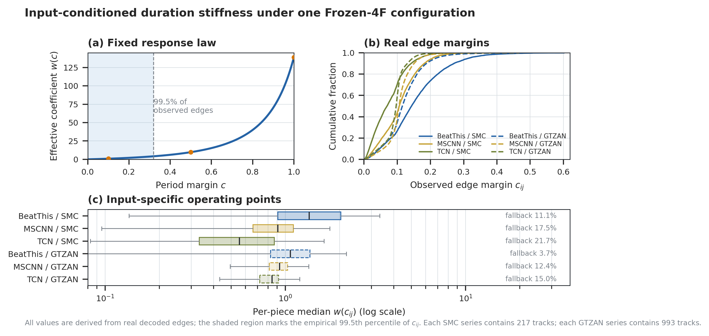
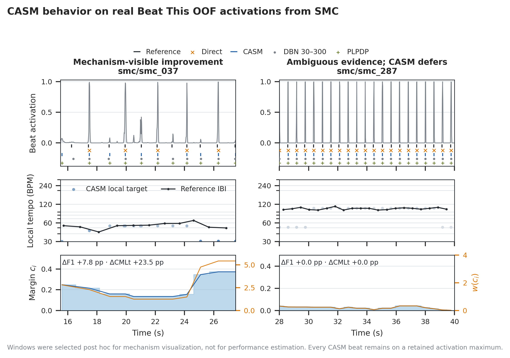

# Figure 1 与 Figure 2 到底在解释什么？——CASM 机制图的完整读法

**日期：** 2026-09-05  
**性质：** 论文写作说明、实验审计与 caption 备忘  
**适用图片：** [Fig. 1 — input-conditioned stiffness](../../gpt-figures/figures-20260904-1443/fig01_input_conditioned_stiffness.png)；[Fig. 2 — real-track mechanism traces](../../gpt-figures/figures-20260904-1443/fig02_real_track_mechanism.png)

## 结论先行

这两张图不是在重复讲同一件事。

| 图 | 回答的问题 | 证据层级 | 最核心的一句话 |
|---|---|---|---|
| Fig. 1 | 一套完全相同的 Frozen-4F 全局参数，是否真的会因输入而产生不同的结构约束？ | 2,637 个 panel--track 实例、147,000 条 structured-path edges 的总体机制证据 | **固定的是 response law，不是每首曲子实际承受的 duration stiffness。** |
| Fig. 2 | 这种 input conditioning 在真实 activation 上究竟怎样改变输出？证据含糊时又会怎样？ | 两首 Beat This / SMC OOF 曲目的可审计案例 | **周期证据清楚时补回有音乐连续性的弱峰；周期证据含糊时让结构项自动变弱，并在当前案例中保留 observation-driven 结果。** |

它们共同服务于 CASM 最难、也最值得讲清楚的主张：

> CASM 并非 parameter-free。它的全局超参数定义一条冻结的 evidence-to-constraint policy；真正作用在每条 transition 上的 period target 与 duration precision，则由当前 activation 自动产生。贡献不是“没有旋钮”，而是把最重要的旋钮调节从逐数据集、逐曲目的人工选择，移到输入条件化的推断过程之中。

但两张图都不能单独证明 CASM “更准确”“比 DBN 更好”或“完全不需要 calibration”。Fig. 1 证明的是机制确实在运行；Fig. 2 解释机制怎样运行。平均性能、因果贡献和 calibration burden 分别还要由 aggregate results、ablation 以及 calibration-sensitivity experiment 支撑。

---

## 一、先把图中的数学对象说清楚

### 1. CASM 不是在所有帧上强行画一条节拍网格

CASM 首先从 beat activation 中保留局部极大值作为 candidate events。对于 candidate $i$，它在一个 8 s 的局部窗口内计算 30--300 BPM 所对应 lag 的归一化自相关分数，从中得到最佳局部周期 $\tau_i$。

候选周期的可靠程度由最佳分数和次佳分数的相对间隔表示：

\[
c_i
=
\operatorname{clip}
\left(
\frac{s_i^{(1)}-s_i^{(2)}}{|s_i^{(1)}|+\epsilon},
0,1
\right).
\]

代码在寻找次佳周期时排除了最佳 lag 左右各两个 lag，因此 $c_i$ 主要反映“最佳周期是否明显优于附近之外的竞争周期”。周期和 margin 随后都经过长度为 5 的 median filter 稳定。

这里有一个论文写作上很重要的精度：**$c_i$ 是 period-score margin / reliability proxy，不是经过校准的概率，也不是“模型有 $c_i\times100\%$ 的把握”。**它处于 $[0,1]$ 只是由定义和 clipping 决定。

### 2. 从 candidate quantity 到 edge quantity

如果动态规划考虑从 candidate $i$ 转移到 $j$，实现使用两个端点的几何平均：

\[
\tau_{ij}=\sqrt{\tau_i\tau_j},
\qquad
c_{ij}=\sqrt{c_ic_j}.
\]

冻结配置给出

\[
\sigma(c)=\sigma_0+(1-c)\sigma_u,
\qquad
w(c)=\frac{\lambda c}{2\sigma(c)^2},
\]

本次 Frozen-4F 中

\[
\lambda=4,
\qquad \sigma_0=0.12,
\qquad \sigma_u=0.4.
\]

因此 edge duration cost 为

\[
D_{ij}
=w(c_{ij})
\left[
\log\frac{\Delta_{ij}}{\tau_{ij}}
\right]^2,
\]

其中 $\Delta_{ij}$ 是两个 candidate 的实际时间间隔。动态规划在 activation node score 与上述 duration cost 之间寻找最高分路径。

这套设计同时调节两个方面：

- $c_{ij}$ 高：局部周期胜出得清楚，$\sigma$ 变小、$w$ 快速增大，偏离 $\tau_{ij}$ 的 transition 会受到更强惩罚；
- $c_{ij}$ 低：存在相近的竞争周期或倍频/半频歧义，$\sigma$ 变宽、$c_{ij}$ 本身又缩小 cost amplitude，结构约束趋弱，activation node score 更能主导结果。

这就是 Fig. 1 和 Fig. 2 所谓的 **input-conditioned stiffness**。它不是根据 ground truth 在测试时拟合参数，而是从未标注 activation 中计算当前 transition 应该承受多强的 duration regularization。

---

## 二、Fig. 1：证明“一套固定参数并不等于一把固定尺子”



Fig. 1 的逻辑顺序是：**先给出固定规则，再给出真实输入落在规则的哪里，最后显示不同曲目实际得到什么 operating point。**

### (a) Fixed response law：冻结的到底是什么？

横轴是 margin $c$，纵轴是 duration cost 前面的有效系数 $w(c)$。蓝线不是从实验结果拟合出来的回归曲线，而是 Frozen-4F 三个全局常数确定的解析函数。

几个有助于形成直觉的数值是：

| $c$ | $\sigma(c)$ | $w(c)$ | 直觉 |
|---:|---:|---:|---|
| 0 | 0.52 | 0 | duration term 完全退场 |
| 0.10 | 0.48 | 0.87 | 很软的 continuity preference |
| 0.50 | 0.32 | 9.77 | 明显的 duration constraint |
| 1.00 | 0.12 | 138.89 | 理论上的极强 constraint |

曲线的非线性非常重要：margin 上升不仅线性增加 amplitude，还会通过缩小 $\sigma$ 再次增强精度。因此 CASM 不是一个固定 transition penalty 乘以一点 confidence，而是 confidence 同时控制 penalty 的强度和容忍宽度。

蓝色阴影覆盖 $c\le0.340$，即本实验全部真实 edges 的 99.5%。这告诉我们一个必须诚实写出的事实：虽然理论曲线在 $c=1$ 时达到 138.89，真实解码几乎都运行在曲线左侧的柔和区域。观测到的 $w$ 中位数、99.5th percentile 和最大值分别为 0.951、4.623 和 15.473。

所以本 panel 的正确结论不是“CASM 经常施加强到 139 的节拍刚性”，而是：

> Frozen-4F 定义了一个可连续退让的非线性 response law；在真实数据上，CASM 主要表现为 graded soft regularization，而不是 hard metronome。

### (b) Real edge margins：不同输入把同一规则带到哪里？

这是所有 provisional structured paths 上 $c_{ij}$ 的 ECDF。读 ECDF 时，在同一个累计比例 $y$ 上，曲线越靠右，表示这一组 edge margin 整体越大；曲线越靠左，表示更多 edges 处于含糊、低约束区域。

各 panel 的 edge-level margin 中位数如下：

| Activation panel | Edge 数 | median $c_{ij}$ | 90th percentile $c_{ij}$ |
|---|---:|---:|---:|
| Beat This / SMC OOF | 10,990 | 0.143 | 0.271 |
| MSCNN-lite / SMC OOF | 9,751 | 0.106 | 0.182 |
| TCN / SMC final0 | 12,149 | 0.069 | 0.142 |
| Beat This / GTZAN seed0 | 58,409 | 0.115 | 0.188 |
| MSCNN-lite / GTZAN | 55,701 | 0.106 | 0.151 |

因此 Beat This / SMC 的周期证据在这些 panels 中相对更有区分度，TCN / SMC final0 最含糊，其余介于二者之间。同样的 $(\lambda,\sigma_0,\sigma_u)$ 并没有让所有 backbone 和 corpus 承受相同 rigidity；activation 的周期结构决定它们落在 response law 的哪一段。

但这里不能偷换成“margin 越高，模型质量越好”。较高 margin 只表示局部 periodic hypothesis 更占优势；这个 hypothesis 仍可能落在错误的 octave、half-tempo 或 double-tempo。Fig. 2 右侧正是为什么还需要 ambiguity-aware restraint 的例子。

还要注意，panel (b) 是 **edge-weighted** ECDF：edge 较多或曲目较长的实例贡献更多点。它适合说明 CASM 实际处理过的 transition evidence，却不是每首曲目等权的性能统计。panel (c) 因此改用 per-piece summary。

### (c) Input-specific operating points：每首曲子最后“挂了几挡”？

每个 boxplot 的统计单位是一首曲子的 provisional structured path。先在一首曲子的所有 edges 上取 $w(c_{ij})$ 中位数，再在同一 panel 的曲目之间画分布；横轴是 log scale。

| Activation panel | per-piece median $w$ 的 Q1 | 中位数 | Q3 | Beat fallback rate |
|---|---:|---:|---:|---:|
| Beat This / SMC OOF | 0.908 | 1.357 | 2.031 | 11.1% |
| MSCNN-lite / SMC OOF | 0.661 | 0.909 | 1.108 | 17.5% |
| TCN / SMC final0 | 0.333 | 0.556 | 0.868 | 21.7% |
| Beat This / GTZAN seed0 | 0.827 | 1.064 | 1.370 | 3.7% |
| MSCNN-lite / GTZAN | 0.814 | 0.928 | 1.029 | 12.4% |

box 的位置差异说明跨 corpus/backbone 的 operating point 不同；box 自身的宽度说明即使在同一个 panel 内，不同曲目也会得到不同的实际 stiffness。这里最直接支持的是 **input-conditioned inference**，而不是 parameter count 变少。

右侧 fallback 比例是另一层 risk control。若 provisional structured beat count 与 Direct count 的比值低于 0.85 或高于 1.8，最终 beat output 会退回 Direct。必须区分：

- boxplot 中的 $w$ 来自 fallback 判定之前的 provisional structured path；
- fallback 百分比是最终输出层面的 track-level safeguard；
- fallback 由 count ratio 触发，并不是“只要 $c$ 小就 fallback”；
- 因而不能仅根据五个 fallback 百分比推断 $w$ 与 fallback 的单调因果关系。

### Fig. 1 真正证明了什么？

它有力证明：

1. 冻结全局参数后，CASM 仍会从每个输入生成 edge-specific $c_{ij},\tau_{ij},\sigma_{ij},w_{ij}$；
2. 这些有效控制量在不同 backbone、dataset 和曲目之间确实变化，而不是数学上有定义、实际上却近乎常数；
3. 真实 operating regime 主要是柔性约束，这与“risk-controlled correction”叙事一致。

它没有证明：

1. 这种变化必然提高 accuracy；该因果问题由 fixed-precision、strength-only、width-only 等 ablation 回答；
2. CASM 不需要任何 development calibration；Frozen-4F 本身仍是 validation-selected configuration；
3. CASM 比 DBN 更 adaptive。DBN 也会随 observation 推断 latent tempo/phase path，二者的区别需要从 potential 如何被局部 context 调制以及 calibration burden 来论证；
4. $c$ 是可靠的 uncertainty probability；它只是算法内部的 margin。

---

## 三、Fig. 2：把“自动纠正”和“自动退让”放到真实声音轨迹上



Fig. 2 使用的不是合成 toy signal，而是 Beat This 在 SMC validation fold 上的 OOF activation：左侧 `smc_037` 来自 fold 5，右侧 `smc_287` 来自 fold 6。两首曲子都未触发 beat-count fallback，因此图里看到的“纠正”和“退让”来自 semi-Markov score 本身，而不是事后把结果硬换回 Direct。

### 先读懂三行分别是什么

**上行：activation 与事件。**灰线是 Beat This beat probability。下方五条 event raster 依次是 reference、Direct、CASM、DBN 30--300 和 PLPDP。它们在负的纵轴位置只是为了错开显示，并不表示负概率。Direct 使用 7-frame max-pooling 且要求 logit $>0$，等价于 beat probability $>0.5$；CASM 则从 probability $\ge0.03$ 的局部极大值建立更丰富的候选图，再由路径分数选择其中一部分。

**中行：局部 target tempo。**蓝点是 CASM 从 activation 自己估计的 $60f_s/\tau_i$（$f_s=50$ fps），颜色深浅编码 $c_i$；黑线是 reference inter-beat interval 换算的 BPM，只用于人类解释。Reference IBI 从未输入 CASM。

**下行：何时相信局部 target。**蓝色是 candidate-level $c_i$，橙色是由同一 response law 计算的 endpoint coefficient $w(c_i)$。真正的 transition cost 使用两端几何平均得到 $c_{ij}$ 和 $\tau_{ij}$，所以该行是 edge behavior 的直观诊断，不应误称为每条 edge 的精确 cost。

### 左侧 `smc_037`：主要是在补回漏掉的拍，而不只是“删除坏峰”

显示窗口为 15.5--27.5 s。该窗口内：

| 序列 | 事件数 | 在 70 ms tolerance 下匹配 reference 的事件数 |
|---|---:|---:|
| Reference | 11 | — |
| Direct | 5 | 5 |
| CASM | 10 | 9 |
| DBN 30--300 | 11 | 10 |
| PLPDP | 11 | 10 |

Direct 基本只保留约每两拍出现一次的高 activation peaks，形成明显的 half-tempo / skipped-beat pattern。CASM 在约 53.6 BPM 的局部 target 支持下，不是凭空移动事件位置，而是从原来已保留的较弱 local maxima 中补出中间拍，同时舍弃不适合形成连续路径的其他 candidates。窗口中所有 Direct 和 CASM 事件都与 retained candidate 精确重合。

该窗口的 14 个 candidates 中，$c_i$ 中位数为 0.160，$w(c_i)$ 中位数为 1.54；窗口末端 margin 上升时 $w(c_i)$ 最高约 5.43。也就是说，成功案例用的是中等、随时间变化的软约束，而不是曲线理论极值附近的强制节拍网格。

图中 `ΔF1 +7.8 pp · ΔCMLt +23.5 pp` 是这首曲子按照正式 5 s trimming 协议计算的 **整曲 CASM-minus-Direct 差值**，不是只对所画 12 s 窗口算出的 headline result。较大的 CMLt 增益符合听觉和轨迹直觉：补回连续漏拍后，连续正确跟踪的 run 会比孤立 F1 match 改善得更明显。

这里还必须避免旧说明中的一个偏差：把左图只写成 “rejecting incompatible activation maxima” 不完整。真实轨迹表明最醒目的作用是 **selecting weak retained maxima to repair a half-tempo sequence**；它当然也会拒绝候选，但“补拍而不移峰”才是这段图最直观的故事。

DBN 与 PLPDP 被画出只是提供 cadence context。它们在这个 post-hoc window 的局部 match 甚至略高于 CASM，因此 Fig. 2 绝不能被当作“CASM 在该曲目上胜过所有 post-processors”的 SOTA 比较图。

### 右侧 `smc_287`：局部 tempo 候选有歧义，CASM 不把可疑规律强加给输出

显示窗口为 28--40 s。reference tempo 约在 97--111 BPM，而 CASM 的局部周期候选在约 50.9 BPM 与 103.4 BPM 之间呈现明显的 octave-related competition。正因为最佳与次佳 lag 分数接近，窗口内 $c_i$ 的中位数只有 0.0306，$w(c_i)$ 的中位数只有 0.237，最大值也仅约 0.332。

结构 duration term 因此接近退场，activation score 主导路径。最终结果是：

- 整首曲子 Direct 与 CASM 都输出 68 beats，而且时间数组逐项完全相同；
- 所画窗口内两者也都输出 21 beats，并获得相同的 20 个 reference matches；
- `ΔF1` 与 `ΔCMLt` 都是 0；
- 该曲目没有触发 count-ratio fallback。

最后一点特别重要。右图展示的不是 safety switch 在错误后“救场”，而是 **ambiguity-conditioned duration potential 自己学会少说话**：局部周期不可信时，CASM 没有让一个可能错误的 50 BPM hypothesis 覆盖清晰的约 100 BPM activation sequence。

这正是“自动挡”比“固定刚性平滑器”更值得推销的行为：不是时时刻刻纠正，而是根据当前 evidence 决定纠正力度。安全 fallback 是第二道刹车；右图展示的是第一道、分级的软退让机制。

还要避免把这个案例推广成数学恒等式。即使 $w(c)$ 很小，CASM 的 candidate topology、30--300 BPM interval support 与动态规划仍然存在，所以低 margin 并不保证 CASM 在每首曲子上都逐点等于 Direct；\`smc_287\` 的完全相同是本次真实输入上观察到的结果。

---

## 四、两个案例是怎样选出来的？为什么可以解释机制、不能估计性能？

选择是明确的 post hoc mechanism mining，而不是随机抽样：

1. 先限定 Beat This / SMC OOF 且未触发 fallback 的曲目；
2. improvement track 在 $\Delta\mathrm{F1}>-0.03$ 后，按 $\Delta\mathrm{CMLt}+0.5\Delta\mathrm{F1}$ 取最高者，得到 `smc_037`；
3. ambiguous track 按整曲 median period margin 取最低者，得到 `smc_287`；
4. 每首曲子内部再扫描 12 s 窗口：左图偏好 CASM 比 Direct 多匹配 reference 的窗口，右图偏好 mean $c_i$ 最低且有足够 reference beats 的窗口。

因此 Fig. 2 是经过两层选择的“显微镜切片”。这不构成方法学错误，只要 caption 明确写出 post hoc and illustrative；它非常适合回答“算法在做什么”，不适合回答“平均能提高多少”。

为避免只保存成功故事，复现包还保留了失败曲目 `smc_266` 和 `gtzan_classical_00051` 的完整 traces。论文若有 supplementary，建议把 improvement、ambiguous 与 failure 三类一起给出。

---

## 五、两张图怎样连成一条论文论证链？

最稳固的顺序是：

1. **Methodology 定义 policy。**用公式说明全局 $(\lambda,\sigma_0,\sigma_u)$ 冻结，而 $\tau_i,c_i,\tau_{ij},c_{ij},w_{ij}$ 由输入逐 candidate / edge 产生。
2. **Fig. 1 证明 policy 确实产生不同 operating points。**这不是把固定超参数改名叫“adaptive”，而是真实 edges 和曲目落在不同的 constraint regime。
3. **Fig. 2 解释两个端点行为。**左侧是有证据时进行 continuity repair；右侧是证据含糊时 observation-preserving deferral。
4. **Fig. 3 ablation 才检验 adaptive components 是否带来 aggregate benefit。**例如 full CASM 相对 local-target/fixed-precision 在 Beat This / SMC OOF 上增加 1.64/1.77 pp CMLt/AMLt，在 MSCNN-lite / SMC OOF 上增加 2.60/3.37 pp；这一步把 Fig. 1 的机制变化与性能联系起来。
5. **Calibration-scale 与 DBN experiments 再回答 deployment burden。**它们讨论不同 calibration subsets 如何选择全局 configuration，而不是 Fig. 1、Fig. 2 的 test-time local conditioning。

换句话说：

> Fig. 1 是 population-level mechanism evidence；Fig. 2 是 trace-level explanation；ablation 才是 component-level causal evidence；main result table 才是 performance evidence。

把四种证据混为一谈会让审稿人容易攻击；把它们各自的任务分清，反而会显得论证非常完整。

---

## 六、ICASSP 正文里应不应该放？

### 我的判断

若“input-conditioned correction，而非 corpus-specific knob turning”仍是本文的核心卖点，**Fig. 1 比 Fig. 2 更适合进入正文**。原因是 Fig. 1 覆盖全部真实 structured edges，并直接回答“CASM 也有许多参数，为什么还叫 adaptive？”这个核心质疑；它不是靠单个好案例成立。

Fig. 2 非常直观，也很有音乐意义，但经过明确的 post-hoc track/window selection。ICASSP 篇幅有限时，建议把它放 supplementary 或项目页；正文可保留一个更窄的双案例 strip，或者只在文字中引用 supplementary。若正文只能在 Fig. 1 与 Fig. 2 中选一个，我会选 Fig. 1，再把版面留给 ablation。

不过 Fig. 1 目前三 panel 仍有压缩空间：正文版可保留 response law 与 per-piece operating points，把完整 ECDF 放 supplementary；或者保留 (a)+(b)，将 fallback rate 移到 risk-control figure。最终应根据整篇四页排版决定，而不是因为图已经画好就强行全部放进正文。

### 绝对不要写的过度主张

- “CASM has no parameters”——错误；它有冻结的全局超参数。
- “CASM learns its parameters from each test track”——错误；它计算 latent operating variables，但不使用 test labels 更新全局参数。
- “A low margin means the estimated tempo is wrong”——错误；只表示 top hypotheses 难区分。
- “Fig. 2 proves a general performance improvement”——错误；曲目和窗口均为 post hoc。
- “CASM always defers through fallback”——错误；`smc_287` 没有触发 fallback，退让来自 $w(c)$ 变小。
- “CASM moves beats onto a cleaner grid”——容易误导；当前 beat path 始终选择 retained activation maxima，它选择/跳过候选，不把事件任意平移到网格位置。
- “TCN / SMC is OOF evidence”——错误；Fig. 1 中该 panel 是 exploratory final0，只有 Beat This / SMC 和 MSCNN-lite / SMC 明确为 OOF。

---

## 七、可直接放进论文的英文解释

### Fig. 1 caption 草案

> **Input-conditioned duration stiffness under one frozen CASM configuration.** (a) The frozen constants define a shared nonlinear mapping from the local period-score margin $c$ to the effective duration coefficient $w(c)$; shading marks the range containing 99.5% of observed structured-path edges. (b) Empirical edge-margin distributions differ across activation backbones and corpora despite identical decoder constants. (c) Per-piece median coefficients consequently occupy distinct operating ranges; annotations report the separate count-ratio fallback rate. Thus, CASM freezes an evidence-to-constraint policy rather than imposing one effective transition rigidity on every input.

### Fig. 2 caption 草案

> **Illustrative CASM behavior on real Beat This OOF activations from SMC.** Left: Direct peak picking retains mainly every second strong activation, whereas CASM uses a supported local period to select intervening retained maxima and recover a more continuous beat path. Right: competing octave-related period hypotheses yield a small margin and a weak duration coefficient, so CASM preserves the Direct path without invoking the count-ratio fallback. Reference IBI is shown only for interpretation and is never observed by the decoder. Tracks and 12-s windows were selected post hoc to expose the mechanism, not to estimate performance; every CASM beat remains anchored to a retained activation maximum.

### 正文中的桥接段落草案

> The global CASM hyperparameters do not constitute a track-specific tempo model. They define how local activation evidence is converted into a duration target and precision. As Fig. 1 shows, the same frozen configuration realizes substantially different edge coefficients across backbones, corpora, and pieces. Fig. 2 illustrates the two resulting regimes: supported periodic evidence can recover weak but rhythmically consistent maxima, whereas ambiguous evidence suppresses the duration potential and leaves observation-driven peak selection unchanged. CASM is therefore not parameter-free; it is an input-conditioned, risk-controlled correction policy under a parameter-frozen deployment protocol.

---

## 八、数据与代码审计记录

本说明不是只根据图片外观逆向猜测，而是逐项核对了以下归档：

- [绘图脚本 `plot_mechanism_evidence.py`](../../self-run-figures/figures-20260904-1443/plot_mechanism_evidence.py)：Fig. 1 的 response curve、ECDF、per-piece boxplot；Fig. 2 的 representative selection 输出读取、window scoring 与三行 trace 布局。
- [上游实验脚本 `run_mechanism_ablation.py`](../../self-run-figures/figures-20260904-1443/run_mechanism_ablation.py)：candidate、edge margin、duration coefficient、fallback、representative export 的精确定义。
- [冻结协议 `protocol.json`](../../self-run-figures/figures-20260904-1443/data/protocol.json)：Frozen-4F 参数 SHA-256 为 `251c96b23223b2e4ddef7f4ab85592663a1c27fcd6d62b1a5d1ef5625ed01f71`，以及五个 activation panels 的来源和样本量。
- [edge-level 数据 `mechanism_edges.csv.gz`](../../self-run-figures/figures-20260904-1443/data/mechanism_edges.csv.gz) 与 [piece-level 数据 `mechanism_piece_summary.csv`](../../self-run-figures/figures-20260904-1443/data/mechanism_piece_summary.csv)：本文重新计算了各 panel 的 margin、coefficient quantiles 与 fallback rates。
- [representative metadata](../../self-run-figures/figures-20260904-1443/data/representatives.json) 与 [完整 trace 目录](../../self-run-figures/figures-20260904-1443/data/representative_traces)：本文重新执行了相同的 12 s window selection，并核对事件数、70 ms matches、candidate anchoring 与 Direct--CASM equality。
- [实验总报告](../../self-run-figures/figures-20260904-1443/mechanism_evidence_report.md) 与 [图表 contracts](../../self-run-figures/figures-20260904-1443/chart_contracts.md)：用于核对每张图原定的 scientific question 与证据边界。
- [QA report](../../self-run-figures/figures-20260904-1443/qa_reference/qa_report.md)：归档运行通过 196/196 checks，包括 panel identity、公式闭合、duration-cost 重算、representative provenance 和“CASM events 均位于 retained maxima”。

数据规模是 2,637 个 panel--track instances，而不是 2,637 首互不重复的歌曲；同一 corpus track 可因 backbone 不同而成为不同实例。Fig. 1 的 147,000 条 edges 来自 fallback 判定之前的 provisional structured paths。SMC 没有 downbeat annotations，因此这两张图只讨论 beat mechanism。

复现说明见 [README](../../self-run-figures/figures-20260904-1443/README.md)。归档 PNG 的 SHA-256 分别为：

```text
64f06c6e0c358f1fe22d969aac0525734d9dac7dbbad5401178407e8d631f942  fig01_input_conditioned_stiffness.png
96f4ef1992016a96532c2da9382d83174a4b2da8fdbf122de3b881720f726390  fig02_real_track_mechanism.png
```

## 最后一句话

如果以后又忘了这两张图在讲什么，只需要记住：

> **Fig. 1 证明同一个 CASM 会因输入而“挂不同的挡”；Fig. 2 展示它什么时候加挡纠正、什么时候松开结构约束。**
